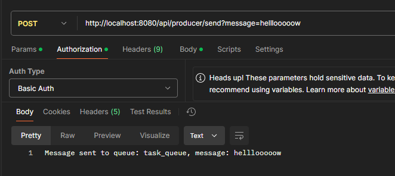
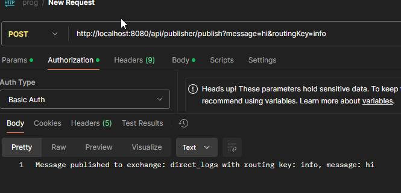
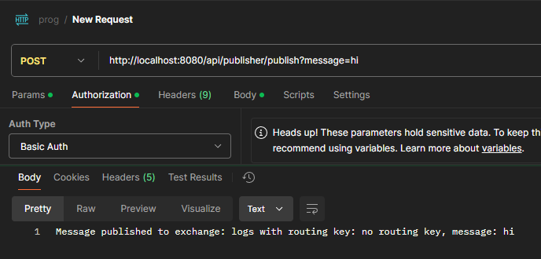
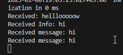
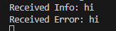

# Практическая работа - RabbitMQ

# Настройка окружения

# 1. Запуск контейнера RabbitMQ
Создаем и запускаем контейнер в Docker:

```bash
docker run -d --hostname rabbitmq --name rabbitmq -p 5672:5672 -p 15672:15672 rabbitmq:3-management
```

Это запустит контейнер RabbitMQ с веб-интерфейсом для управления на порту 15672 и брокером сообщений на порту 5672.

# 2. Установка зависимостей
```bash
mvn clean install
```

# 3. Запуск приложения
Запускаем наже приложение командой:

```bash
mvn spring-boot:run
```

После этого приложение будет доступно по ссылке: http://localhost:8080


# Тест 1: Отправка сообщения через ProducerController


# Тест 2: Публикация сообщения через PublisherController


Пример (без указания маршрутизирующего ключа):



# Тест 3, Тест 4: Получение сообщения в Subscriber

Когда вы публикуете или отправляете сообщение через PublisherController или ProducerController, Subscriber автоматически получит сообщение из обмена logs и выведет его в консоль:
Когда вы публикуете или отправляете сообщение через ProducerController в очередь task_queue, Consumer автоматически получит сообщение и выведет его в консоль:


# Тест 5: Получение сообщений с маршрутизацией через SubscriberWithRouting

Если отправить сообщение с маршрутизирующим ключом info, SubscriberWithRouting получит сообщение через очередь info.
Если вы отправляете сообщение с маршрутизирующим ключом error, SubscriberWithRouting получит сообщение через очередь error.
