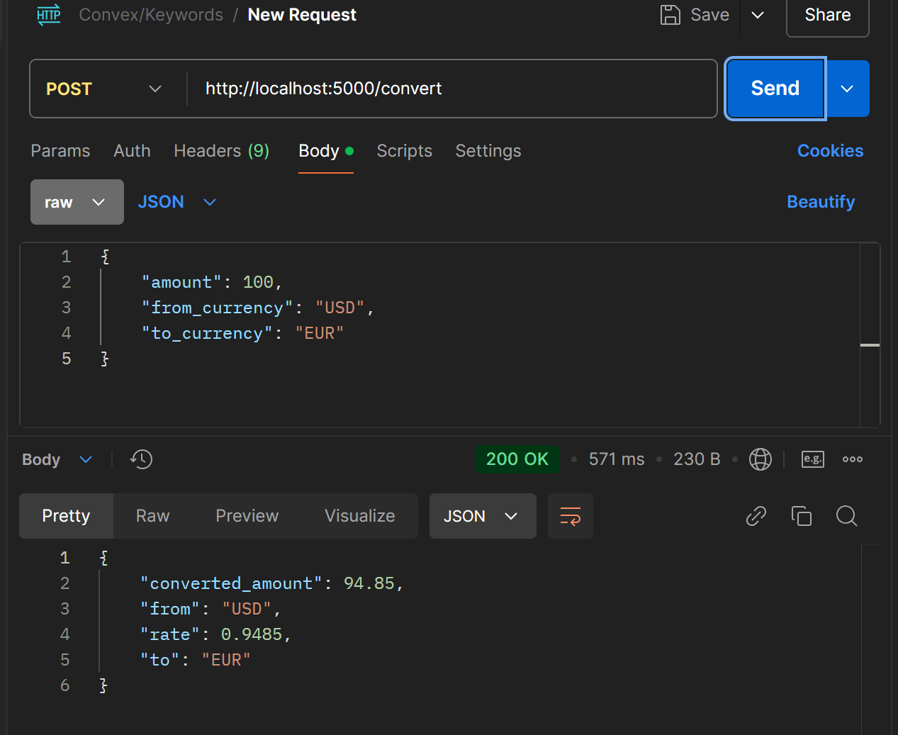
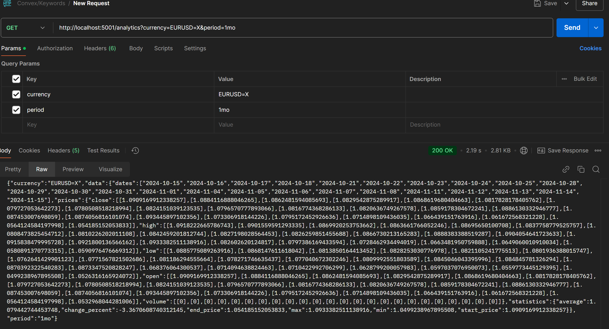

# Лабораторная работа 2

## Микросервисы для конвертации валюты и анализа истории курса валюты

### Сборка и запуск (локально)

Соберите Docker-образ:
```bash
docker build -t currency_converter .
```

Запустите контейнер:
```bash
docker run -p 5000:5000 -p 5001:5001 currency-converter
```

### Примеры запросов (локальные)

#### Конвертация валюты

#### Анализ истории курса валюты


### Как развернуть в YC

